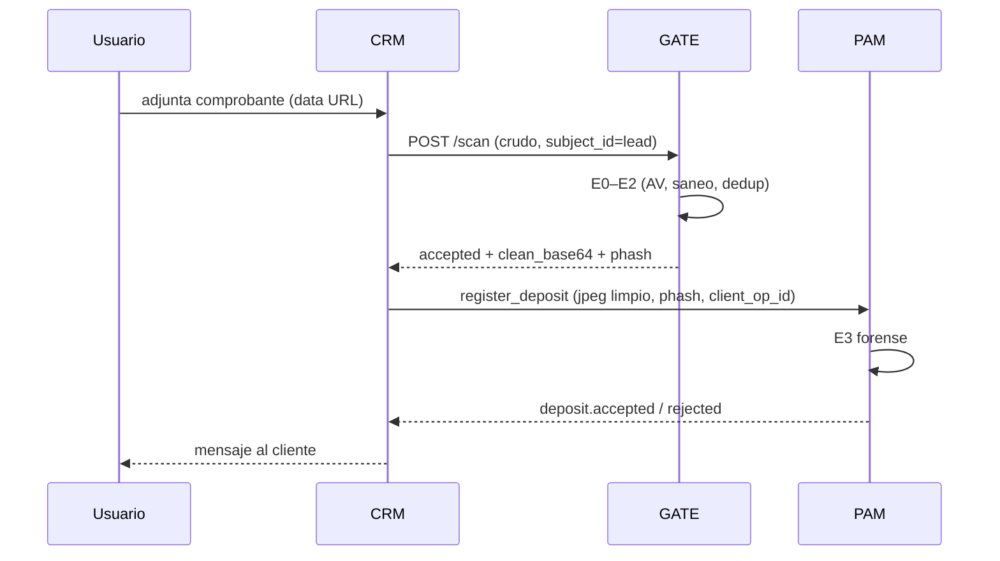

# Arquitectura — Pipeline de comprobantes

> Última actualización: 2026-06-29

## Vista general

```text
                    ┌─ SERVIDOR AISLADO (sacrificable) ─────────────────────┐
                    │  GATE (:4100)                                         │
Livechat (CRM)  ────┤  E0 Antivirus (ClamAV, sidecar)                     │
WhatsApp (CRM)  ────┤  E1 Validación (tamaño, MIME real, dimensiones)    │
Plataforma (PAM)────┤  E2 Sanitización (PDF→PNG, re-encode JPEG, defang) │
                    │  E2b Semántica (pHash dedup + clasificador stub)     │
                    │  E2c Rate-limit (intentos + aceptados)               │
                    └───────────────────────┬─────────────────────────────┘
                                            │  solo cruza la frontera:
                                            │  { jpeg_limpio, phash, veredicto }
                                            ▼
                    ┌─ SERVIDOR PAM (protegido) ──────────────────────────┐
                    │  E3 Forense (Capa 2): monto, match bancario,         │
                    │      edición, antigüedad, anti-fraude global        │
                    │  → acreditar / rechazar → eventos deposit.*         │
                    └─────────────────────────────────────────────────────┘
```

## Qué corre en cada servidor

| Servidor | Procesos | Secretos / BD | Red |
|----------|----------|---------------|-----|
| **GATE** | Node, clamd (sidecar), poppler, sharp | Solo SQLite pHash (dedup); **sin** credenciales PAM/CRM | Entrada: CRM + PAM (Bearer). Egress: mínimo (clamd, updates) |
| **CRM** | Cerebro, livechat, transportes | BD leads, ops, mensajes | Llama gate; habla con PAM (webhook) |
| **PAM** | Next.js, receipt-reader, BD casino | Usuarios, saldos, depósitos | Llama gate en subidas plataforma; recibe JPEG limpio del CRM |

## Frontera de confianza

Lo que **cruza** del gate al cliente:

```json
{
  "status": "accepted",
  "scan_id": "uuid",
  "mime": "image/jpeg",
  "phash": "a1b2c3d4e5f67890",
  "sha256": "7689a1b9...",
  "clean_base64": "<jpeg base64 limpio>",
  "view_url": "https://gate/receipts/{id}?token=...",
  "extraction": { "monto": 50000, "entidad_emisora": "Mercado Pago", "...": "..." },
  "bank": { "canonical": "Mercado Pago", "kind": "billetera", "known": true },
  "validation": { "is_valid": true, "alerts": [] },
  "duplicate_global": { "seen": false, "count": 0 }
}
```

Lo que **no cruza**: archivo original (PDF/PNG/HEIC), metadata, buffers pre-saneo, logs de virus
al cliente. El `view_url` sirve **solo** el JPEG re-encodeado (sin original).

## API del gate (implementada)

| Método | Ruta | Auth | Propósito |
|--------|------|------|-----------|
| POST | `/scan` | Bearer | Núcleo: crudo → JPEG limpio + datos + banco + view_url |
| GET | `/scans/:id` | Bearer | Metadata de la operación (sin reenviar archivo) |
| GET | `/receipts/:id` | token / Bearer | Sirve el JPEG limpio (vista del operador) |
| GET | `/health` | — | Liveness + capacidades + ClamAV + forense |
| GET | `/stats` | Bearer | Telemetría en ventana |

Contrato detallado: [README.md](../README.md) § API.

## Fail-policy

| Escenario | Política | Motivo |
|-----------|----------|--------|
| ClamAV caído (`failClosed=true`) | **Rechazar** scan (502 failed:clamav) | No asumir limpio |
| Gate no responde (cliente CRM/PAM) | **Fail-closed + cola/reintento** (recomendado) | Sin saneo no hay JPEG seguro para E3 |
| Clasificador stub | No bloquea (confianza 1) | Juez semántico = PAM (F7) |

## Hardening del host (pendiente infra)

Checklist prod (de auditoría F4/F5/F8):

- [ ] **Sandbox efímero por archivo** para `pdftoppm` y decodificación (contenedor/microVM: sin red, FS ro, sin root, límites CPU/mem/PID, seccomp). Hoy: subproceso con timeout.
- [ ] **ClamAV sidecar** (ya en `docker-compose.yml`); `freshclam` periódico.
- [ ] **libheif** + **poppler-utils** en imagen (Dockerfile ya los instala).
- [ ] **Egress bloqueado** salvo clamd y updates.
- [ ] **Usuario sin privilegios** (Dockerfile: `USER node`).
- [ ] **Tokens distintos** por cliente (`RECEIPT_GATE_TOKENS=token-crm,token-pam`).

## Evolución arquitectónica (opciones descartadas)

| Opción | Por qué no |
|--------|------------|
| Capa 1 solo en CRM | PAM plataforma sin portero; PAM dependería del repo CRM |
| Capa 1 in-process en PAM | Parsers riesgosos en servidor del dinero |
| Paquete npm compartido | Deps duplicadas; dedup separado por app |

## Diagrama de secuencia (depósito por livechat, target)



> **Hoy:** el CRM aún llama `runReceiptGate` local (no HTTP). Migración pendiente — ver `05_INTEGRACION_CRM_PAM.md`.
